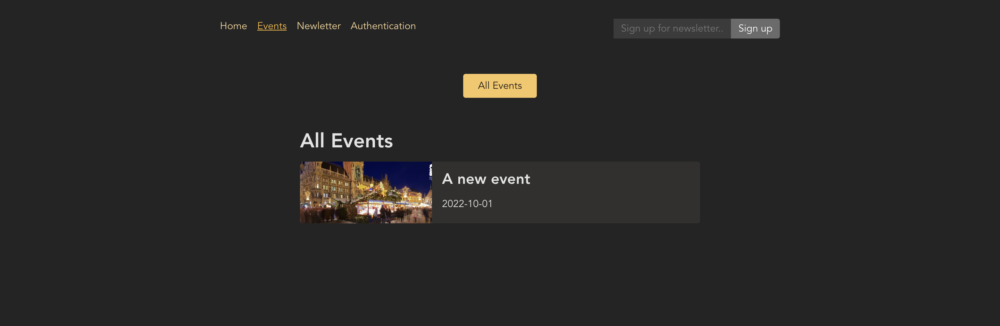

<h1 align='center'>Learn ReactJS - Events App</h1>

### Hướng dẫn sử dụng
#### Clone git repository
- Mở terminal.
- Chạy lệnh `git clone https://github.com/Karhdo/Events-App.git`
#### Run code:
- Di chuyển vào thư mục Events-App/frontend và Events-App/backend chạy lệnh `npm install` (cài đặt các thư viện cần thiết).
- Thực hiện lệnh `npm run start` ở 2 folder frontend và backend sau đó chương trình sẽ chạy ở **port 3000** (http://localhost:3000/) và serve sẽ chạy ở **port 8080** (http://localhost:8080/).

